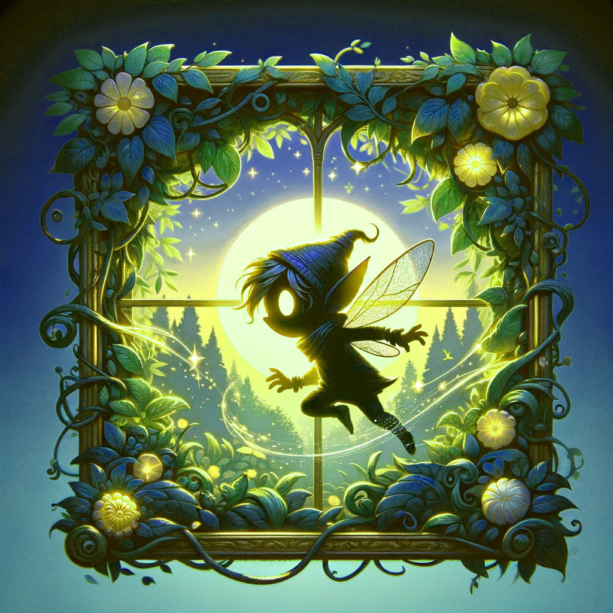

<!--  -->

    

 

# A Midsummer Night's Escape 🌙🧚‍♂️

## Overview :
The project is a game set in the fictional world of William Shakespeare's "**A Midsummer Night's Dream.**" More specifically, it takes place within the enchanted forest of the play. The game is of the "infinite runner" genre, where the player controls a character who continuously runs through an endless environment filled with obstacles and challenges. Gameplay focuses on avoiding obstacles, collecting items, and attempting to travel the greatest distance possible before inevitably being caught or hit by an obstacle.

 

## Story :
### In the realm of the fairies, a fictional follow-up to the play unfolds. 

- **Events Prior to the Game :** In the original play, Titania, the Queen of the Fairies, is enchanted by Puck with a love potion, causing her to fall in love with a man with a donkey's head. 

- **Titania's Revenge :** After the events of the original play, Titania discovers that she was enchanted by a love potion and wishes to seek revenge on Puck. Driven by the desire to set things right, Titania devises a plan that throws the fairy world into chaos. 

- **Puck's Challenge :** The enchanted forest becomes a constantly changing labyrinth, filled with magical obstacles and treacherous terrain. Puck must navigate this unpredictable realm, avoiding traps and overcoming magical obstacles to survive Titania's wrath.

## Gameplay :
As the player takes on the role of Puck, they must navigate through the chaotic and ever-changing enchanted forest. The game offers a fast-paced and challenging experience, where quick reflexes and strategic decision-making are essential for survival.
- Use the SPACEBAR to jump and avoid getting hit.